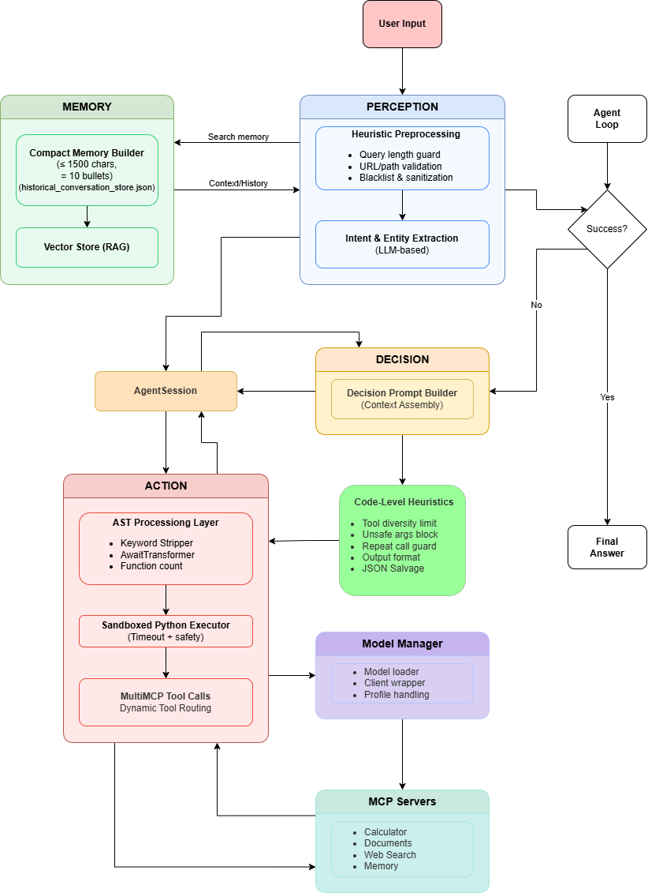

# Week-10: Advanced Multi-Agent System with Human-in-the-Loop

A production-ready agentic AI system with robust error handling, performance monitoring, and human intervention capabilities.

> **Note:** This project uses [uv](https://docs.astral.sh/uv/) for fast, reliable Python package management. All commands use `uv run` for execution.

## 🌟 Features

### Core Capabilities
- **Multi-Agent Architecture** - Perception, Decision, and Action modules working in harmony
- **Human-in-the-Loop (HITL)** - Automatic intervention requests when needed
- **Performance Monitoring** - Real-time tool performance tracking and optimization
- **Smart Planning** - Performance-aware decision making with tool reliability metrics
- **Memory System** - Fuzzy search across historical sessions for context
- **MCP Integration** - Multiple tool servers (math, documents, web search)
- **Execution Limits** - MAX_STEPS and MAX_RETRIES to prevent infinite loops
- **Comprehensive Testing** - 120+ automated tests with rate limiting

### Human-in-the-Loop Triggers
- ❌ **Tool Failures** - Exceptions, timeouts, invalid outputs
- ❌ **Plan Failures** - LLM errors, invalid JSON, bad plans
- ❌ **MAX_STEPS Exceeded** - More than 3 steps executed
- ❌ **MAX_RETRIES Exceeded** - Step retried more than 3 times

## 🚀 Quick Start

### 1. Interactive Mode
```bash
uv run main.py
```

### 2. Full Simulation (Optional, 10-15 minutes)
```bash
uv run simulator.py
```

## 📁 Project Structure

```
Week-10/
├── agent/
│   ├── agent_loop2.py          # Main agent orchestrator
│   ├── agentSession.py         # Session management
│   ├── model_manager.py        # LLM interface
│   ├── tool_performance.py     # Performance tracking
│   └── test.py                 # Unit tests
├── action/
│   └── executor.py             # Sandboxed code execution
├── decision/
│   ├── decision.py             # Planning module
│   └── decision_test.py        # Decision tests
├── perception/
│   ├── perception.py           # Query understanding
│   └── perception_test.py      # Perception tests
├── memory/
│   ├── session_log.py          # Session logging
│   ├── memory_search.py        # Historical search
│   └── session_logs/           # Stored sessions
├── mcp_servers/
│   ├── mcp_math_tools.py       # Math operations
│   ├── mcp_document_tools.py   # Document processing
│   ├── mcp_websearch_tools.py  # Web search
│   ├── mcp_mixed_tools.py      # Mixed tools
│   └── multiMCP.py             # MCP manager
├── config/
│   ├── mcp_server_config.yaml  # MCP configuration
│   ├── models.json             # LLM models
│   └── profiles.yaml           # Agent profiles
├── prompts/
│   ├── perception_prompt.txt   # Perception instructions
│   └── decision_prompt.txt     # Decision instructions
├── heuristics/
│   └── heuristics.py           # Validation rules
├── main.py                     # Interactive entry point
├── simulator.py                # Comprehensive testing
└── README.md                   # This file
```

## 🔧 Configuration

### Execution Limits
Edit `agent/agent_loop2.py`:
```python
MAX_STEPS = 3      # Maximum steps before HITL
MAX_RETRIES = 3    # Maximum retries per step
```

### LLM Model
Edit `config/profiles.yaml`:
```yaml
llm:
  text_generation: gemini  # or phi4, gemma3:12b, qwen2.5:32b-instruct-q4_0
  embedding: nomic
```

### Planning Strategy
Edit `config/profiles.yaml`:
```yaml
strategy:
  planning_mode: conservative  # or exploratory
  exploration_mode: parallel   # or sequential
```

### MCP Servers
Edit `config/mcp_server_config.yaml`:
```yaml
mcp_servers:
  - id: math
    script: mcp_math_tools.py
    description: "Math operations"
    capabilities: ["add", "subtract", "multiply", ...]
```

## 📊 Performance Tracking

### View Tool Performance
```bash
# Real-time monitoring
tail -f tool_performance_log.jsonl

# View recent entries
tail -n 50 tool_performance_log.jsonl
```

### Performance Log Format
```json
{
  "tool": "add",
  "success": true,
  "latency_ms": 45.23,
  "retries": 0,
  "timestamp": "2025-02-15T12:33:11Z"
}
```

### Tool Reliability Classification
- ✅ **RELIABLE** - Success rate ≥ 80%
- ⚠️ **UNRELIABLE** - Success rate 50-80%
- ❌ **FAILING** - Success rate < 50%
- ❌ **AVOID** - 3+ consecutive recent failures

## 🏗️ Architecture

### System Architecture Diagram



The diagram above shows the complete architecture of the Week-10 multi-agent system, including:
- **Perception Module** - Query understanding and result interpretation
- **Decision Module** - Performance-aware planning and replanning
- **Action Module** - Sandboxed code execution with tool calls
- **Memory System** - Session logging and historical search
- **MCP Servers** - Multiple tool servers (math, documents, web search)

### Module Responsibilities

**Perception Module**
- Analyzes user queries and step results
- Returns structured ERORLL format
- Can directly answer obvious queries

**Decision Module**
- Creates and revises execution plans
- Uses tool performance stats
- Supports conservative and exploratory strategies

**Action Executor**
- Sandboxed Python code execution
- AST transformation for async tools
- Timeout protection and limits

**MultiMCP**
- Manages multiple MCP servers
- Dynamic tool discovery and routing
- Performance logging

**Memory System**
- Session logging with date structure
- Fuzzy search across history
- Provides context for similar queries

---

## 🔄 Architecture Evolution: Week-9 to Week-10

### Major Changes from Week-9

Week-10 represents a **major architectural refactoring** from Week-9, transforming a complex MCP-centric system into a **simplified, modular, production-ready multi-agent architecture**.

#### Key Transformations

| Aspect | Week-9 | Week-10 | Change |
|--------|--------|---------|--------|
| **Architecture** | MCP-centric | Agent-centric | Refocused |
| **Agent Loop** | Lifelines-based retries | Session-based plan versioning | NEW |
| **Heuristics** | 10 code-level rules | 5 input validation rules | -50% |
| **Error Handling** | Lifelines (3 retries) | HITL (4 trigger types) | Enhanced |
| **Performance Tracking** | ❌ None | ✅ Comprehensive | NEW |
| **Testing** | ❌ Manual only | ✅ 120+ automated tests | NEW |
| **Memory System** | Complex scoring (6 factors) | Fuzzy search (3 factors) | Simplified |
| **MCP Servers** | 3 single files | 4 organized files | Better organized |
| **Prompts** | 7 variations | 2 unified | -71% |
| **Safety Mechanism** | Heuristics validation | MAX_STEPS + MAX_RETRIES + HITL | Simplified |

#### Design Philosophy Evolution

**Week-9: "Prevent Everything"**
- 10 heuristics to catch all issues
- Complex validation rules
- Embedded safety checks
- Fully autonomous operation

**Week-10: "Detect and Ask"**
- Simple validation (5 rules)
- Human intervention when needed
- Performance monitoring
- Clear error messages with suggested plans

#### What's New in Week-10

1. **Session-Based Plan Versioning** - Track complete execution history with plan versions instead of simple retries
2. **Human-in-the-Loop (HITL)** - 4 trigger types for automatic intervention
3. **Performance Monitoring** - Real-time tool performance tracking
4. **Automated Testing** - 120+ comprehensive tests with rate limiting
5. **Simplified Heuristics** - Focused on input validation only
6. **Better Organization** - Clear module separation (agent/, action/, decision/, perception/)
7. **Tool Performance Stats** - Success rates, latency, reliability classification
8. **Execution Limits** - MAX_STEPS (3) and MAX_RETRIES (3)

#### Heuristics Comparison

**Week-9 (10 Heuristics):**
1. Query Length Guard
2. Tool Confidence Scoring
3. Unsafe Argument Filter
4. Sandbox Execution Timeout
5. Tool Diversity Limit
6. Output Structure Enforcement
7. Repeat Tool-Call Guard
8. Memory Pollution Guard
9. Server Availability Check
10. AST-Based solve() Linter

**Week-10 (5 Heuristics):**
1. URL Validation
2. File Path Validation
3. Sentence Length Check
4. Blacklist Check
5. URL Protocol Check

**Why the change?** Simplified to focus on input validation, with HITL handling complex error scenarios.

#### Error Handling Evolution

**Week-9: Lifelines System**
```
Error → Retry (Lifeline 1) → Retry (Lifeline 2) → Retry (Lifeline 3) → Fail
```

**Week-10: HITL System**
```
Error → HITL Trigger → Pause → Request Human Input → 
Provide Suggested Plan → Wait for Guidance
```

#### Performance Impact

| Metric | Week-9 | Week-10 | Change |
|--------|--------|---------|--------|
| Heuristic Validation | <10ms | <5ms | 50% faster |
| Memory Search | <100ms | <50ms | 50% faster |
| Tool Call Overhead | Minimal | +1-2ms (logging) | Acceptable |
| Code Complexity | High | Low | Simpler |
| Maintainability | Complex | Simple | Better |

---

## 🔒 Security Features

### Sandboxed Execution
- Whitelisted module imports
- Function call limits (MAX_FUNCTIONS = 5)
- Timeout protection (500s per function)
- No file system access by default

### Allowed Modules
```python
ALLOWED_MODULES = {
    "math", "cmath", "decimal", "fractions", "random", "statistics",
    "itertools", "functools", "operator", "string", "re", "datetime",
    "calendar", "time", "collections", "heapq", "bisect", "types",
    "copy", "enum", "uuid", "dataclasses", "typing", "pprint", "json",
    # ... and more
}
```

### Heuristics Validation
- URL validation and protocol fixing
- File path validation
- Sentence length checks
- Blacklist filtering
- Extensible rule system

## 🚧 Future Enhancements

Potential improvements:
- [ ] Resume from HITL with human-provided guidance
- [ ] Adaptive retry strategies based on tool performance
- [ ] Real-time performance dashboard
- [ ] Automatic tool deprecation for consistently failing tools
- [ ] A/B testing different planning strategies
- [ ] Cost tracking per session
- [ ] Performance regression detection
- [ ] Streaming for long-running operations
- [ ] Embeddings-based memory retrieval
- [ ] Tool usage analytics

## 🎉 Acknowledgments

Built with:
- Google Gemini API
- MCP (Model Context Protocol)
- Python asyncio
- FAISS for document search
- RapidFuzz for memory search

