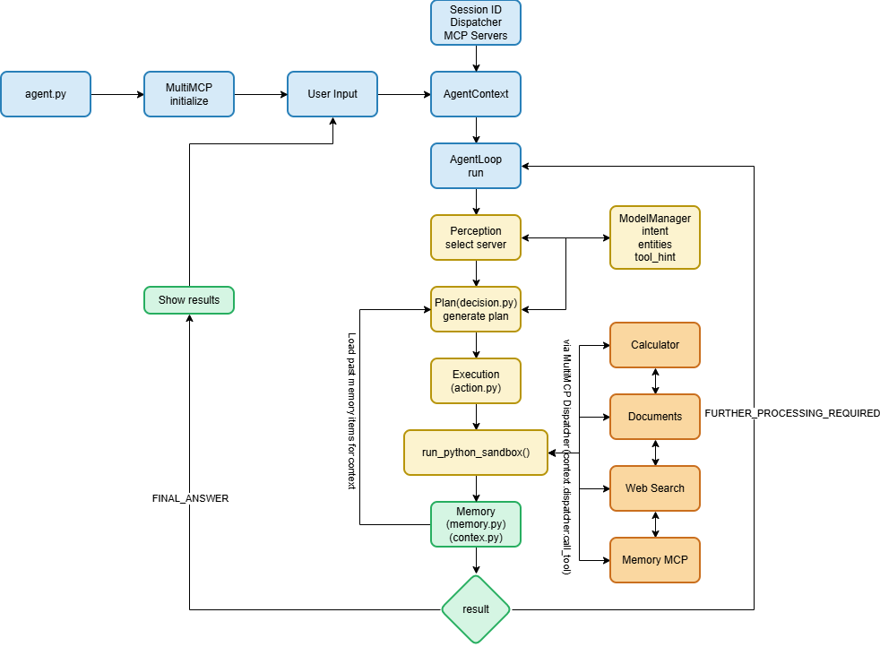

# Week 9: Hybrid Planning (AI + Heuristics)

## Overview

This week focuses on building a production-ready AI agent system that combines LLM-based planning with code-level heuristics for robust, safe, and efficient execution. The agent implements a complete cognitive architecture with perception, planning, action, and memory systems.

## Key Features

### 1. **10 Code-Level Heuristics**
All heuristics run in Python (not in prompts) for deterministic, fast validation:

1. **Query Length Guard** - Truncates queries >1500 chars
2. **Tool Confidence Scoring** - Scores tools by similarity + recent success
3. **Unsafe Argument Filter** - Blocks dangerous patterns (path traversal, XSS, SQL injection)
4. **Sandbox Execution Timeout** - 30-second limit on solve() execution
5. **Tool Diversity Limit** - Blocks plans using >3 distinct tools
6. **Output Structure Enforcement** - Removes markdown, imports, extra definitions
7. **Repeat Tool-Call Guard** - Blocks same tool called >2 times
8. **Memory Pollution Guard** - Skips empty/duplicate/error outputs
9. **Server Availability Check** - Filters unavailable servers
10. **AST-Based solve() Linter** - Validates code safety (no eval, exec, file ops)

### 2. **Smart Historical Conversation Indexing**
Intelligent memory system that learns from past interactions:

- **Weighted Composite Scoring**:
  - Recency (30%) - Exponential decay over 7 days
  - Semantic Relevance (30%) - Cosine similarity to query
  - Tool Success Signal (15%) - Bonus for successful tool usage
  - Provenance (10%) - Presence of timestamps, tool names
  - Length Penalty (10%) - Shorter items scored higher
  - Diversity Bonus (5%) - Avoid near-duplicates

- **Automatic Storage**: All interactions logged to `historical_conversation_store.json`
- **Compressed Summaries**: ≤1500 chars, ≤10 bullet points
- **Format**: `"- YYYY-MM-DD — <intent> — <summary> — [tool: X] — score: 0.xx"`

### 3. **Short Decision Prompt**
Streamlined prompt (139 words) with:
- Clear tool usage examples (Math, Document Search, Web Search)
- Explicit JSON extraction rules
- Historical context injection
- No embedded heuristics (all in code)

### 4. **Multi-Server MCP Architecture**
Three specialized MCP servers:

#### **Math Server** (`mcp_server_math.py`)
- Basic operations: add, subtract, multiply, divide, power, cbrt, factorial
- Trigonometry: sin, cos, tan
- Special functions: strings_to_chars_to_int, int_list_to_exponential_sum, fibonacci_numbers
- Image processing: create_thumbnail

#### **Documents Server** (`mcp_server_documents.py`)
- **FAISS-based RAG**: Vector search with nomic-embed-text
- **Document Processing**: PDF (pymupdf4llm), Webpages (trafilatura)
- **Image Captioning**: Gemma3:12b for alt-text generation
- **Semantic Chunking**: LLM-based intelligent document segmentation
- **Tools**: search_stored_documents, convert_webpage_url_into_markdown, extract_pdf

#### **WebSearch Server** (`mcp_server_websearch.py`)
- **DuckDuckGo Search**: Rate-limited, bot-detection aware
- **HTML Fetching**: download_raw_html_from_url
- **Result Formatting**: LLM-friendly output

### 5. **Agent Architecture**



## Project Structure

```
Week-9/
├── agent.py                          # Main agent entry point
├── config/
│   └── profiles.yaml                 # Agent configuration
├── core/
│   ├── context.py                    # Agent context & state
│   ├── loop.py                       # Main agent loop
│   ├── session.py                    # MCP session management
│   └── strategy.py                   # Planning strategies
├── modules/
│   ├── action.py                     # Sandboxed execution
│   ├── decision.py                   # Plan generation
│   ├── perception.py                 # Query understanding
│   ├── memory.py                     # Session memory
│   ├── memory_index.py               # Memory summarization
│   ├── historical_index.py           # Historical conversation indexing
│   ├── heuristics_code.py            # 10 code-level heuristics
│   ├── model_manager.py              # LLM interface
│   └── tools.py                      # Tool utilities
├── prompts/
│   └── decision_prompt_conservative_short.txt  # 139-word prompt
├── mcp_server_math.py                # Math tools server
├── mcp_server_documents.py           # RAG & document processing
├── mcp_server_websearch.py           # Web search tools
├── models.py                         # Pydantic models
├── documents/                        # Document storage
├── faiss_index/                      # Vector index
├── memory/                           # Session memory storage
└── historical_conversation_store.json # Historical interactions
```

## Usage

### Basic Usage

```bash
uv run agent.py
```

### Example Queries

**Math Query:**
```
Find the ASCII values of characters in INDIA and return sum of exponentials
```
Result: `7.59982224609308e+33`

**Document Query:**
```
How much did Anmol Singh pay for his DLF apartment via Capbridge?
```
Result: `Rs. 42.94 Crore`

**Web Search Query:**
```
Determine whether Tesla and Panasonic currently maintain a manufacturing partnership
```
Result: Search results with partnership information

**Historical Context Query:**
```
Explain how you answered my previous three questions
```

<details>
<summary>Click to expand full execution log</summary>

```
🔁 Step 1/3 starting...

[08:41:47] [perception] Raw output: 
{
  "intent": "Explanation of past answers and influence of previous conversation.",
  "entities": ["previous three questions", "past conversation"],
  "tool_hint": null,
  "selected_servers": ["math", "documents", "websearch"]
}

[08:41:47] [plan] 📚 Historical context retrieved (1495 chars)

Historical context includes:
- 2025-11-15 — How much Anmol singh paid... — Rs. 42.94 Crore — [tool: duckduckgo_search_results] — score: 0.71
- 2025-11-15 — Take the word "AGENT"... — 2028301 — [tool: strings_to_chars_to_int, power] — score: 0.70
- 2025-11-15 — Find ASCII values of INDIA... — 7.59982224609308e+33 — [tool: strings_to_chars_to_int, int_list_to_exponential_sum] — score: 0.70
- 2025-11-15 — Summarize research themes... — AI, machine learning and models — [tool: convert_webpage_url_into_markdown] — score: 0.68
- 2025-11-15 — What do you know about Don Tapscott... — open source strategies — [tool: search_stored_documents] — score: 0.68

[08:41:55] [plan] LLM output:
import json
async def solve():
    # heuristics_checklist = {"unsafe_args": False, "tool_limit": True, "repeats": False}
    past_conversations = [...]
    
    answer = "Here's how I answered your previous three questions:\n\n"
    
    # Question 1: Anmol Singh DLF apartment
    answer += "1. The first question was about how much Anmol Singh paid for his DLF apartment via Capbridge. "
    answer += "I used both `duckduckgo_search_results` and `search_stored_documents`. "
    answer += "The search results indicated that Capbridge paid Rs. 42.94 Crore to DLF Limited (DLF).\n"
    answer += "Tool used: `duckduckgo_search_results`, `search_stored_documents`\n"
    answer += "Information influencing the decision: High scores (0.71) were obtained.\n\n"
    
    # Question 2: AGENT ASCII power
    answer += "2. The second question involved converting 'AGENT' to ASCII values and raising each "
    answer += "value to the power of its position. Tools: `strings_to_chars_to_int`, `power`. "
    answer += "Result: 2028301.\n"
    answer += "Information influencing the decision: Score of 0.70.\n\n"
    
    # Question 3: INDIA exponential sum
    answer += "3. The third question asked to find ASCII values of 'INDIA' and compute exponential sum. "
    answer += "Tools: `strings_to_chars_to_int`, `int_list_to_exponential_sum`. "
    answer += "Result: 7.59982224609308e+33.\n"
    answer += "Information influencing the decision: Score of 0.70.\n"
    
    return f"FINAL_ANSWER: {answer}"

[loop] Detected solve() plan — running sandboxed...
[action] 🔍 Entered run_python_sandbox()

💡 Final Answer: 
Here's how I answered your previous three questions:

1. The first question was about how much Anmol Singh paid for his DLF apartment via Capbridge. 
   I used both `duckduckgo_search_results` and `search_stored_documents`. 
   The search results indicated that Capbridge paid Rs. 42.94 Crore to DLF Limited (DLF).
   Tool used: `duckduckgo_search_results`, `search_stored_documents`
   Information influencing the decision: High scores (0.71) were obtained from results 
   containing 'Capbridge paid Rs. 42.94 Crore to DLF Limited (DLF)'.

2. The second question involved converting 'AGENT' to ASCII values and raising each value 
   to the power of its position. The tools used were `strings_to_chars_to_int` to get 
   ASCII values, and `power`. The final result was 2028301.
   Tool used: `strings_to_chars_to_int`, `power`
   Information influencing the decision: The conversation including the correct final 
   answer 2028301 got a score of 0.70.

3. The third question asked to find the ASCII values of 'INDIA' and compute the exponential 
   sum. I used `strings_to_chars_to_int` to get the ASCII values and then 
   `int_list_to_exponential_sum` to calculate the sum. The final answer was 7.59982224609308e+33.
   Tool used: `strings_to_chars_to_int`, `int_list_to_exponential_sum`
   Information influencing the decision: The conversation including the correct final 
   answer 7.59982224609308e+33 got a score of 0.70, making the response relevant.
```

</details>

Result:
```
Here's how I answered your previous three questions:

1. The first question was about how much Anmol Singh paid for his DLF apartment 
   via Capbridge. I used both `duckduckgo_search_results` and `search_stored_documents`. 
   The search results indicated that Capbridge paid Rs. 42.94 Crore to DLF Limited (DLF) 
   as part of the consideration.
   Tool used: `duckduckgo_search_results`, `search_stored_documents`
   Information influencing the decision: High scores (0.71) were obtained from results 
   containing 'Capbridge paid Rs. 42.94 Crore to DLF Limited (DLF)'.

2. The second question involved converting 'AGENT' to ASCII values and raising each 
   value to the power of its position. The tools used were `strings_to_chars_to_int` 
   to get ASCII values, and `power`. The final result was 2028301.
   Tool used: `strings_to_chars_to_int`, `power`
   Information influencing the decision: The conversation including the correct final 
   answer 2028301 got a score of 0.70.

3. The third question asked to find the ASCII values of 'INDIA' and compute the 
   exponential sum. I used `strings_to_chars_to_int` to get the ASCII values and 
   then `int_list_to_exponential_sum` to calculate the sum. The final answer was 
   7.59982224609308e+33.
   Tool used: `strings_to_chars_to_int`, `int_list_to_exponential_sum`
   Information influencing the decision: The conversation including the correct final 
   answer 7.59982224609308e+33 got a score of 0.70, making the response relevant.
```

**Complex Math Query:**
```
Take the word "AGENT" and convert each character into its ASCII value, 
compute the cube of each ASCII number, and then return the total sum.
```

<details>
<summary>Click to expand full execution log</summary>

```
🔁 Step 1/3 starting...

[08:42:12] [perception] Raw output:
{
  "intent": "Convert characters to ASCII, cube them, and sum the results.",
  "entities": ["AGENT", "ASCII", "cube", "sum"],
  "tool_hint": "python sandbox",
  "selected_servers": ["math"]
}

[08:42:12] [plan] 📚 Historical context retrieved (1495 chars)

[08:42:15] [plan] LLM output:
import json
async def solve():
    # heuristics_checklist = {"unsafe_args": False, "tool_limit": True, "repeats": False}
    input = {"input": {"string": "AGENT"}}
    result = await mcp.call_tool('strings_to_chars_to_int', input)
    ascii_values = json.loads(result.content[0].text)["result"]
    
    sum_of_cubes = 0
    for value in ascii_values:
        input = {"input": {"a": value, "b": 3}}
        result = await mcp.call_tool('power', input)
        cube = json.loads(result.content[0].text)["result"]
        sum_of_cubes += cube
    
    return f"FINAL_ANSWER: {sum_of_cubes}"

[loop] Detected solve() plan — running sandboxed...
[action] 🔍 Entered run_python_sandbox()

Tool calls executed:
- strings_to_chars_to_int("AGENT") → [65, 71, 69, 78, 84]
- power(65, 3) → 274625
- power(71, 3) → 357911
- power(69, 3) → 328509
- power(78, 3) → 474552
- power(84, 3) → 592704

💡 Final Answer: 2028301
```

</details>

Result: `2028301`

**Web Content Analysis:**
```
Summarize the research themes presented on https://ai.googleblog.com/ 
and extract the top three recurring topics.
```

<details>
<summary>Click to expand full execution log</summary>

```
🔁 Step 1/3 starting...

[08:42:32] [perception] Raw output:
{
  "intent": "Summarize a webpage and identify recurring topics.",
  "entities": ["https://ai.googleblog.com/", "research themes", "top three recurring topics"],
  "tool_hint": "webpage summarization, topic extraction",
  "selected_servers": ["documents", "websearch"]
}

[08:42:32] [plan] 📚 Historical context retrieved (1426 chars)

[08:42:34] [plan] LLM output:
import json
async def solve():
    # heuristics_checklist = {"unsafe_args": False, "tool_limit": True, "repeats": False}
    input = {"input": {"url": "https://ai.googleblog.com/"}}
    result = await mcp.call_tool('convert_webpage_url_into_markdown', input)
    markdown_content = result.content[0].text
    
    if markdown_content:
        input = {"input": {"query": "research themes on ai.googleblog.com"}}
        result = await mcp.call_tool('search_stored_documents', input)
        if result:
            return f"FINAL_ANSWER: Research themes on ai.googleblog.com include AI, machine learning and models. To determine the top three recurring topics, further analysis of the blog content is required."
        else:
            return f"FURTHER_PROCESSING_REQUIRED: {markdown_content}"
    else:
        return "FINAL_ANSWER: Could not retrieve content from the URL."

[loop] Detected solve() plan — running sandboxed...
[action] 🔍 Entered run_python_sandbox()

Tool calls executed:
- convert_webpage_url_into_markdown("https://ai.googleblog.com/")
- search_stored_documents("research themes on ai.googleblog.com")

💡 Final Answer: Research themes on ai.googleblog.com include AI, machine learning and models. 
To determine the top three recurring topics, further analysis of the blog content is required.
```

</details>

Result: `Research themes on ai.googleblog.com include AI, machine learning and models.`

### Adding Documents

Place documents in the `documents/` folder:
- PDFs: Automatically extracted with pymupdf4llm
- Web URLs: Save as `.url` files
- HTML: Direct HTML files

Run the agent - documents are automatically indexed on first use.

## Key Concepts

### Heuristics vs Prompts

**Traditional Approach (Prompt-based):**
- Embed rules in LLM prompts
- Unreliable enforcement
- Slow (LLM must process rules)
- Hard to debug

**Our Approach (Code-based):**
- Heuristics in Python
- Deterministic validation
- Fast (microseconds)
- Easy to debug and modify

### Historical Context

The agent learns from past interactions:
1. Every query/answer is logged with tools used
2. Future queries retrieve relevant past conversations
3. Scoring system ranks by relevance, recency, success
4. Compressed summaries injected into planning

### Sandboxed Execution

All tool calls run in isolated sandbox:
- AST validation before execution
- Timeout protection (30s)
- Unsafe pattern blocking
- Tool call limits (10 max)
- No file system access
- No eval/exec/import

## Advanced Features

### Memory System

**Session Memory:**
- Tracks current conversation
- Tool calls and results
- Success/failure status

**Historical Memory:**
- Cross-session learning
- Weighted scoring
- Automatic compression
- Diversity control

### Tool Tracking

The system tracks actual MCP tools used (not just the sandbox wrapper):
```json
{
  "timestamp": "2025-11-13T23:35:36",
  "user": "Find ASCII values...",
  "assistant": "7.59982224609308e+33",
  "tool": "strings_to_chars_to_int, int_list_to_exponential_sum",
  "success": true
}
```

### Error Recovery

- Automatic retries with lifelines
- Heuristic-based validation
- Graceful degradation
- Informative error messages

## Performance

- **Query Processing**: <1s (perception + planning)
- **Heuristic Validation**: <10ms
- **Historical Context Retrieval**: <100ms
- **Sandbox Execution**: <30s (timeout)
- **Memory Indexing**: <50ms

## Safety Features

1. **Input Validation**: Query length, unsafe patterns
2. **Code Validation**: AST linting, no dangerous operations
3. **Execution Limits**: Timeout, tool call limits
4. **Output Sanitization**: Clean markdown, remove imports
5. **Memory Protection**: Pollution guard, duplicate detection

## Future Enhancements

- [ ] Multi-agent collaboration
- [ ] Streaming responses
- [ ] Custom heuristic plugins
- [ ] Web UI dashboard
- [ ] Distributed execution
- [ ] Advanced error recovery strategies

## Resources

- [MCP Documentation](https://modelcontextprotocol.io/)
- [FastMCP](https://github.com/jlowin/fastmcp)
- [FAISS](https://github.com/facebookresearch/faiss)
- [The School of AI](https://theschoolof.ai/)

## Credits

- **Course**: EAG V2 - Extensive AI Agents Program
- **Institution**: The School of AI
- **Week**: 9 - Hybrid Planning (AI + Heuristics)

---

**Built with ❤️ for production-ready AI agents**
